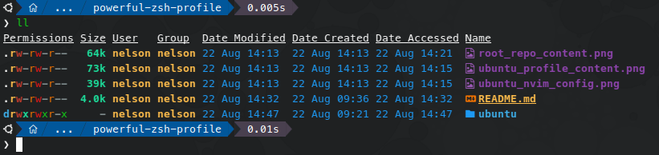
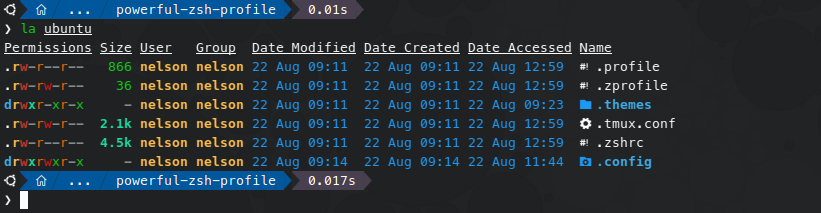
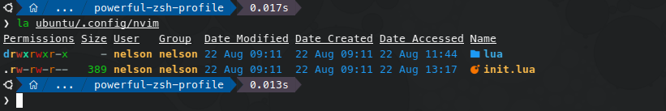

# My powerful ZSH profile

**NOTE:** All this content was created under Linux Ubuntu 24.04 Desktop, but with small adjustments, the following can be used for Windows and macOS too.

Due to my constant Senior Linux SysAdmin work, I migrated some time ago from `BASH` to `ZSH` shell with all the following and very beneficial tools:

- **[Oh My Zsh](https://ohmyz.sh)** - `Oh My Zsh` framework for managing the `ZSH` configuration.
- **[Oh My Posh](https://ohmyposh.dev)** - Put your terminal prompt nice!
- **[nerd-fonts](https://www.nerdfonts.com)** - It is required for the `Oh My Posh` configuration.
- **[eza](https://github.com/eza-community/eza)** - A nice tool for listing files on the terminal.
- **[nvim](https://neovim.io)** - A very nice and powerful text editor.
- **[tmux](http://tmux.github.io/)** - A powerful terminal multiplexer.
- **[zsh-autosuggestions](https://github.com/zsh-users/zsh-autosuggestions)** - A very common zsh plugin for autosuggestions.
- **[zsh-syntax-highlighting](https://github.com/zsh-users/zsh-syntax-highlighting)** - A very common zsh plugin for syntax highlighting.
- **[zsh-history-substring-search](https://github.com/zsh-users/zsh-history-substring-search)** - A very common zsh plugin for history search.
- **[tmux-xpanes](https://github.com/greymd/tmux-xpanes.git)** - A very powerful complement for the `tmux` multiplexer.
- **[lxd-completion-zsh](https://github.com/endaaman/lxd-completion-zsh)** - `lxc` commands constantly upgrade, so that this plugin will fix the issue with the tab completion for the rest of the `lxc` subcommands.


## Content

- Root Repository Content

   


- Ubuntu Profile Content

   


- Ubuntu Neovim Configuration

   


## Installation

1. Install `Oh My Zsh` and `Oh My Posh`.

   **Oh My Zsh:**

   ```shell
   sudo apt install git curl zsh zip unzip -y
   sh -c "$(curl -fsSL https://raw.githubusercontent.com/ohmyzsh/ohmyzsh/master/tools/install.sh)"
   ```

   **Oh My Posh:**

   ```shell
   mkdir ~/bin
   curl -s https://ohmyposh.dev/install.sh | bash -s -- -d ~/bin
   ```

   **Optional: Only if wanted to install `Oh My Zsh` and `Oh My Posh` in the `root` prompt.**

   ```shell
   sudo su -
   sh -c "$(curl -fsSL https://raw.githubusercontent.com/ohmyzsh/ohmyzsh/master/tools/install.sh)"
   mkdir ~/bin
   curl -s https://ohmyposh.dev/install.sh | bash -s -- -d ~/bin
   exit
   exit
   ```


2. Run the following commands to install the plugins.

   **NOTE:** If using the `root` prompt too, don't forget to run the following `git clone` commands in `root`.

   **Ubuntu Packages:**

   ```shell
   sudo apt install eza tmux neovim -y
   ```

   **`Oh My Zsh` Plugins:**

   ```shell
   git clone https://github.com/zsh-users/zsh-autosuggestions ${ZSH_CUSTOM:-~/.oh-my-zsh/custom}/plugins/zsh-autosuggestions
   git clone https://github.com/zsh-users/zsh-syntax-highlighting ${ZSH_CUSTOM:-~/.oh-my-zsh/custom}/plugins/zsh-syntax-highlighting
   git clone https://github.com/zsh-users/zsh-history-substring-search ${ZSH_CUSTOM:-~/.oh-my-zsh/custom}/plugins/zsh-history-substring-search
   git clone https://github.com/greymd/tmux-xpanes.git ${ZSH_CUSTOM:-~/.oh-my-zsh/custom}/plugins/tmux-xpanes
   git clone https://github.com/endaaman/lxd-completion-zsh ${ZSH_CUSTOM:-~/.oh-my-zsh/custom}/plugins/lxd-completion-zsh
   ```

   **`tmux` Plugins:**

   ```shell
   git clone https://github.com/tmux-plugins/tpm ~/.tmux/plugins/tpm
   git clone https://github.com/tmux-plugins/tmux-sensible ~/.tmux/plugins/tmux-sensible
   git clone https://github.com/tmux-plugins/tmux-yank ~/.tmux/plugins/tmux-yank
   git clone https://github.com/tmux-plugins/tmux-copycat ~/.tmux/plugins/tmux-copycat
   git clone https://github.com/jimeh/tmux-themepack.git ~/.tmux/plugins/tmux-themepack
   ```


## Configuration

1. Clone and copy the config files and directories from this repository to use them at `~/` for the `$USER` to configure the profile, do the same for `root` if it is also in use.


2. Download the nerd-fonts package with the following command:
   ```shell
   wget https://github.com/ryanoasis/nerd-fonts/releases/download/v3.2.1/Meslo.zip -O ~/Downloads/nerd-fonts.zip
   ```

2. Use the `~/Downloads/nerd-fonts.zip` package recently downloaded to install/configure the fonts in the terminal for `Oh My Posh` prompt.


## `nerd-fonts` Installation

1. Run the following commands to install the fonts.

   ```shell
   sudo unzip ~/Downloads/nerd-fonts.zip -d /usr/share/fonts/nerd-fonts
   sudo fc-cache -v -f /usr/share/fonts
   ```

2. Once the fonts are installed, use the terminal app of your choice and set the font `MesloLGM Nerd Font`.


3. Set the `ZSH` shell as default.


   **For non-root:**

   ```shell
   chsh -s /bin/zsh $USER
   ```

   **For root: (Optional: Only if was installed `Oh My Zsh` and `Oh My Posh` in `root`.)**

   ```shell
   sudo su -
   chsh -s /bin/zsh root
   exit
   ```


4. Finally, do a logout and log back in or reboot the machine to see the new shell coming.


At this point, we should be all set and have a powerful ZSH prompt.

I hope all this above helps others! 😎
